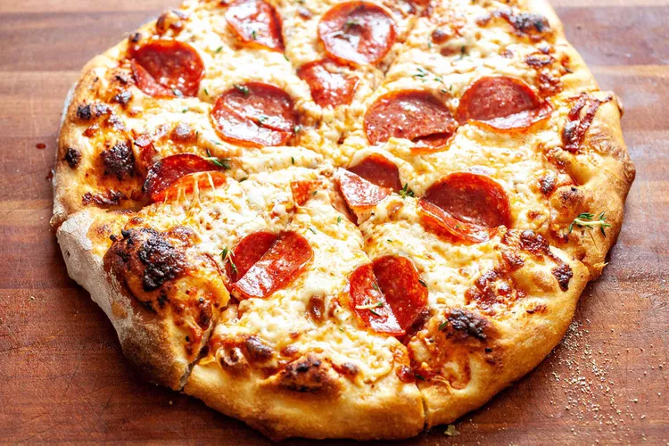

# Homemade Pepperoni Pizza

## Ingredients
 16 ounces pizza dough, store-bought or homemade (I like this no-knead version, though note that this recipe makes enough dough for 2 pizzas)
 1/2 cup pizza sauce (see below)
 18 to 20 slices pepperoni
 12 ounces mozzarella cheese, grated
 1/2 teaspoon ground black pepper
 1 teaspoon fresh oregano, optional
 Flour for rolling and shaping dough

### Quick Pizza Sauce
1. 1/2 cup tomato sauce (no salt)
2. 1/2 teaspoon kosher salt
3. 1/2 teaspoon ground black pepper
4. 1/2 teaspoon granulated garlic
5. 1/2 teaspoon granulated onion
6. 1/4 teaspoon red pepper flakes
7. 1 teaspoon olive oil

extra info: [extra info](https://www.simplyrecipes.com/recipes/homemade_pepperoni_pizza/)